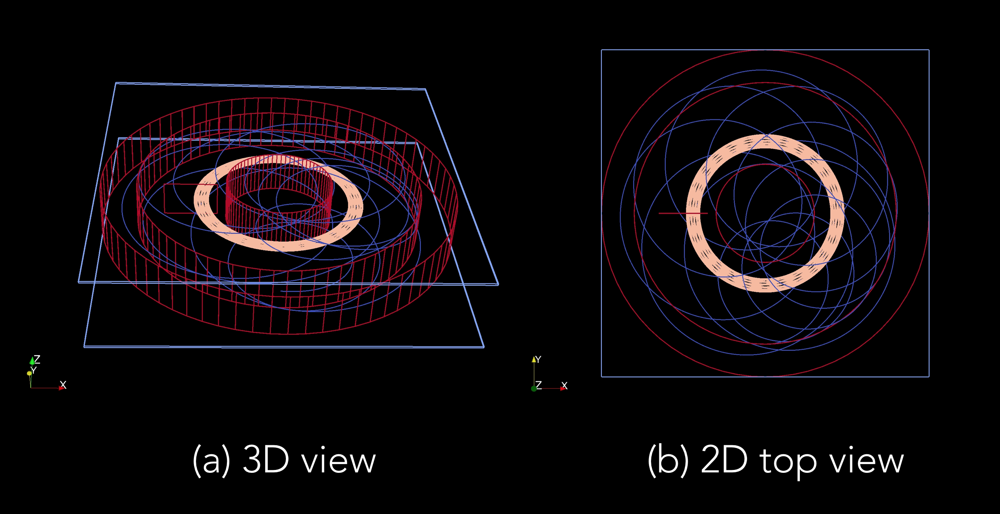

# FS-muonEDM

This is a repository for simulation and analysis codes for the frozen spin muon EDM search experiment. It is based on the musrSim package developed for PSI's Low Energy Muon (LEM) Beamline.

# Pre-requisite:

1) Geant4 installation (tested on geant4.10.03.p03)
2) Visualization plugin (I used Paraview: https://www.paraview.org/download/)

# New Classes:

In addition to all the existing musrSim classes, several ad-hoc classes like the following are added:

1) musrGradientField - This will enable the user to set a gradient magnetic field configuration in the simulation
2) musrRadialField - This will enable the user to set a radial electric field configuration in the simulation
3) run/electrodeEField.txt - This will enable the user to use a radial electric field configuration simulated using COMSOL

# Running the example:

1) Compile FS-muonEDM package
2) Go to the run folder
3) Execute the command `../bin/Darwin-clang/musrSim 101.mac` (for Mac)

# Example event display

